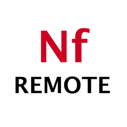
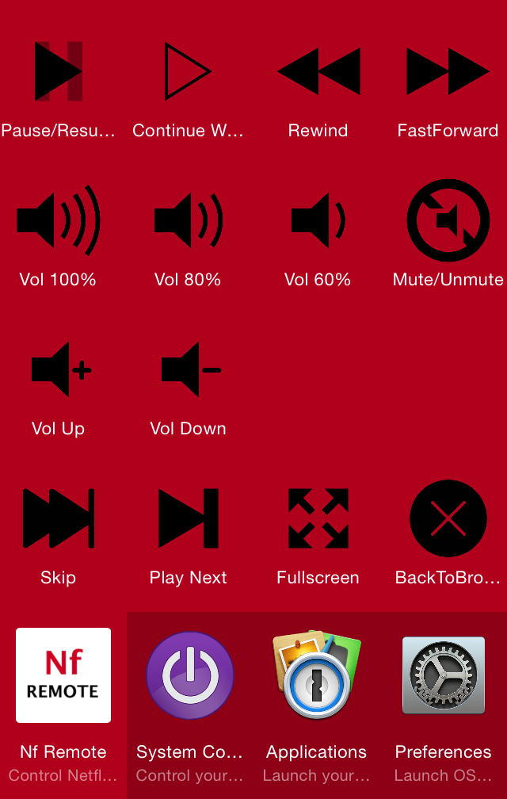

# NfRemote
Control Netflix with Alfred Remote

## About this Project
With this [Alfred][alf] workflow you are able to control Netflix in your browser from your mobile device running [Alfred Remote][alfremote].
This workflow emulates mouse movement and clicks to gain access to the Netflix Browser UI. The mouse emulation is executed by the awesome command line utility [Cliclick][cliclick].
The icons are from [ionicons][ionicons].

## How to get it working / Troubleshooting
Netflix Remote only works when your browser has focus and runs in __full screen__ mode. Otherwise the mouse emulation won't find the correct position.

## What it can do
 * Press play/pause
 * Set the volume to 100%, 80%, 60%
 * Mute/unmute the volume
 * Skip forward
 * Press "continue playing"
 * Go back to browsing (Stop Netflix)
 * Play next

## Screenshot

[alf]:http://www.alfredapp.com/
[alfremote]:http://www.alfredapp.com/remote/
[cliclick]:http://www.bluem.net/en/mac/cliclick/
[ionicons]:https://github.com/driftyco/ionicons/